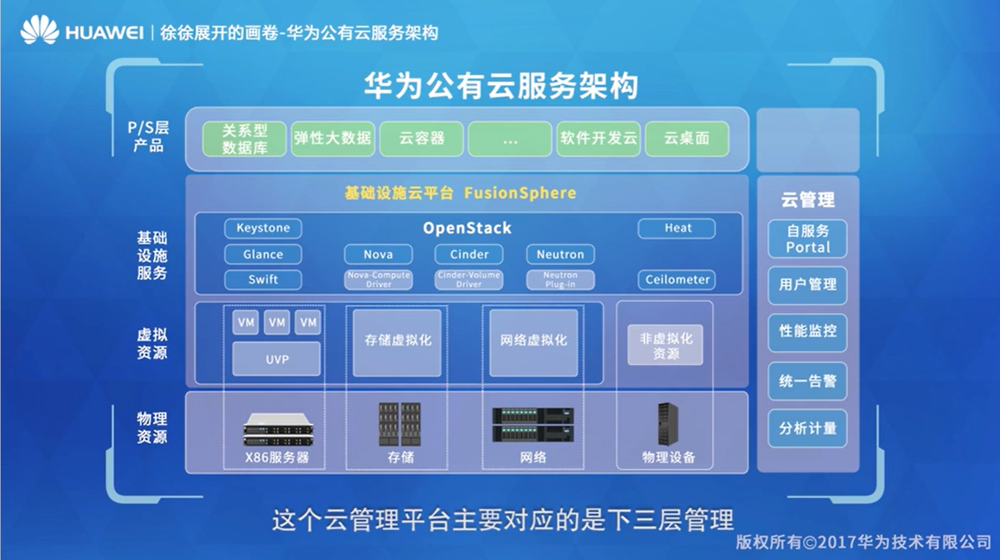

云计算的发展历程：
虚拟化 -> 私有云 -> 多数据中心整合 -> 混合云

弹性调度

DRS: 自动迁移存储

HA: 主机宕了，VM跟着也宕了，HA出现用于江湖救急

虚拟化是将传统IT资源（计算、存储、网络）逻辑化，也就是不再直接使用，通过`Hypervisor`层进行统一调度

云计算的特点：
+ 敏捷（按需自助服务）
+ 设备、位置无关，各处可接入
+ 水平扩展，弹性
+ 可度量
+ 资源池化
+ 多租户
+ 易维护
+ 降成本
+ 安全

#### 云服务的类型（XaSS）
+ `IaaS`: 计算，存储，网络（NaSS），CDN，数据库（DBaSS）等基础服务
+ `PaaS`: 开发框架，（任何不属于`IaSS`和`SaSS`的东西）
+ `SaaS`: 应用软件通过服务的形式提供，WorkDay, Office 365等

### 华为云有云服务架构
物理资源 -> 虚拟资源 -> 基础设施服务 -> P/S层产品
